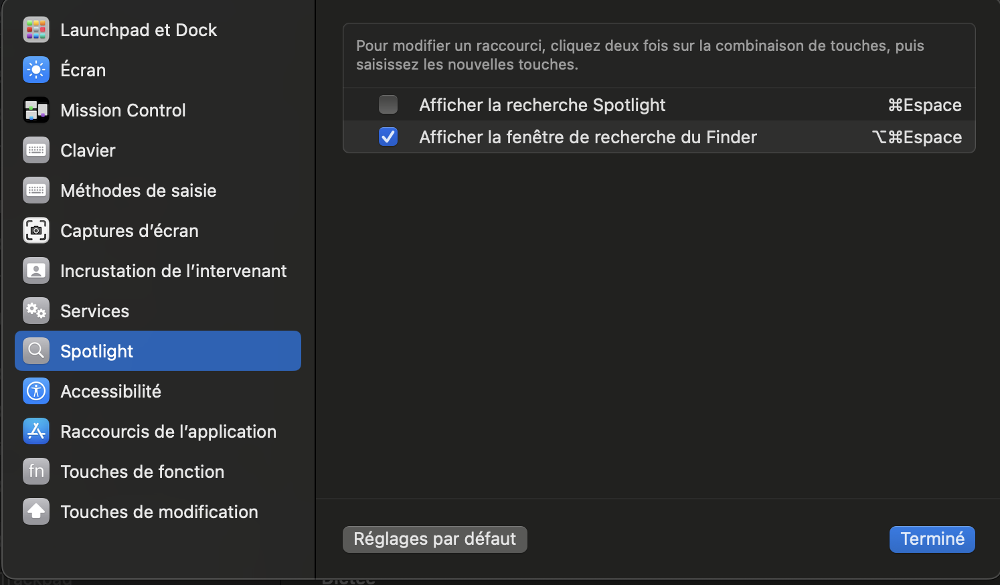

# MacOS Buildout

This repo acts as a log for my buildout of my laptop. As I add stuff or change settings, I log it here so pave & restores can go quickly in the future. Feel free to fork & customize to your liking.

More background info: [BLOG: Rapid Complete Install / Reinstall OS X Like a Champ in Three-ish Hours](http://www.andrewconnell.com/blog/rapid-complete-install-reinstall-os-x-like-a-champ-in-three-ish-hours)

## Before Paving, document current config

Do the following before paving the partition. This is to get the way I have things configured in the dock & menu bar back the way I want them.

  > **NOTE:** many of the hidden files & folders are copied as "dot-files"

  - `~/.gitconfig`
  - `~/.zsh`
  - `~/.zprofile`
  - `~/.zshenv`
  - `~/.zshrc`
  - *review other folders in the root*
- Node
  - refresh NPM global package install list: **./scripts/npm-install-packages-lts-*.zsh**

    ```console
    npm list -g --depth=0
    ```

- Visual Studio Code
  - refresh installed extensions install list: **[./scripts/vscode-ext-install.zsh](./scripts/vscode-ext-install.zsh)**

      ```console
      code --list-extensions
      ```

  - backup snippets & user settings to **{{PRIVATE_BACKUP}}/VisualStudioCode**
    - user settings: `~/Library/Application Support/Code/User`

### Installed apps

- get list of all apps installed via Homebrew:

  ```console
  brew leaves
  ```

## Install apps

The following installs & configuration should be done to setup automated installs.

### If installing on Apple Silicon

Install Rosetta 2

```console
sudo softwareupdate --install-rosetta
```

### Homebrew & Homebrew Cask

Install [Homebrew](http://brew.sh/) for automated installs & updates.

```console
/bin/bash -c "$(curl -fsSL https://raw.githubusercontent.com/Homebrew/install/HEAD/install.sh)"
```

> [!TIP]
> If get error about `zsh compinit: insecure directories, run compaudit for list.`, first try to run the following to see if it fixes it:
>
> ```console
> chmod go-w '/opt/homebrew/share'
> chmod -R go-w '/opt/homebrew/share/zsh'
> ```
>
> ... if the issue persists, do what it says:
>
> `$ compaudit`
>
> For the folder(s) returned, fix it with:
>
> `$ sudo chmod -R 755 {PATH}`

### Install fonts

```console
curl -L https://raw.githubusercontent.com/bcatouillard/osx-install/main/scripts/core-fonts.zsh | zsh
```

### Install & setup console

Installs ideal shell, prompt, and terminals

> **NOTE**: Monitor the terminal for password prompts & errors/warnings.

1. run following to install cores

    ```console
    curl -L https://raw.githubusercontent.com/bcatouillard/osx-install/main/scripts/core-install.zsh | zsh
    ```

1. copy the **[dotfiles & folders](./dotfiles/)** (overwriting existing) into home folder
1. search for any `{{{REPLACE_THIS}}}` and replace with correct values
1. setup SSH with 1Password for `.gitconfig`
  - **1Password > Settings > Developer** & select all options

### Install apps via Homebrew: `homebrew-install-apps.zsh`

Install apps using Homebrew.

> **NOTE**: Monitor the terminal for password prompts & errors/warnings.

run following to install cores

  ```console
  curl -L https://raw.githubusercontent.com/bcatouillard/osx-install/main/scripts/homebrew-install-apps.zsh | zsh
  ```

Pay attention for extra installs & steps at the end.

### Install Mac App Store apps: `macos-install.zsh`

Install apps from the Apple App Store.

```console
curl -L https://raw.githubusercontent.com/bcatouillard/osx-install/main/scripts/macos-install.zsh | zsh
```

### Manual Installs

- [XX](yy)


### Configure core apps to acquire backups, licenses & passwords

- login to the following apps
  - Microsoft Edge
- Visual Studio Code
  - install extensions collected before pave:

      ```console
      curl -L https://raw.githubusercontent.com/bcatouillard/osx-install/main/scripts/vscode-ext-install.zsh | zsh
      ```

  - copy snippets & settings:
    - from **[./AppSettings/VisualStudioCode](./AppSettings/VisualStudioCode)**
    - to `~/Library/Application Support/Code/User`

### Configure Installed Apps

- Slack
- Discord
- Notion

## Install Node

Manage node installs using NVM... this lets me test different versions of node as well as avoid issue with having to use `sudo` when installing packages globally.

```console
mkdir ~/.nvm
```

### Install & configure Node LTS & stable versions

> [!CAUTION]
> The following script doesn't work. Something is causing `nvm` to not be seen as a valid comment.
>
> Instead, copy the blocks of code from the following installer script file and manually run in the console.

This script installs multiple Node versions:

```console
curl -L https://raw.githubusercontent.com/bcatouillard/osx-install/main/scripts/node-install.zsh | zsh
```

## Post installation & configuration checks

### Update Homebrew, Homebrew Cask & purge installs

```console
brew doctor
brew update
brew cleanup
```

### Setup git

> NOTE: This might already be done by copying the hidden **~./.gitconfig**.

```console
git config --global user.name "Benjamin Catouillard"
git config --global user.email <insert primary email>
# set VSCode as commit message editor & merge tool
git config --global merge.tool code
```

### MacOS Tweaks

- Shortcuts - uncheck options for Spotlight, then manually setup activation keystroke for Raycast to <kbd>CMD</kbd>+<kbd>SPACE</kbd>

  


## Ongoing... HOWTO Keep Things Updated

to keep Homebrew installed things update, do this:

  ```console
  brew update           # download app updated formulas
  brew outdated         # what's old?
  brew upgrade          # upgrade everything locally
  # list all brew casks installed & their versions
  brew cask outdated
  brew cask upgrade
  # cleanup everything
  brew cleanup
  ```

update MacOS apps:

  ```console
  mas outdated    # what's old
  mas upgrade     # upgrade everything
  ```

update MacOS: [ref](https://developer.apple.com/legacy/library/documentation/Darwin/Reference/ManPages/man8/softwareupdate.8.html)

  ```console
  softwareupdate --list
  # install things based on the name returned using
  sudo softwareupdate --install [name listed]
  ```